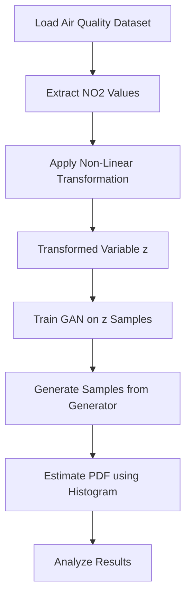
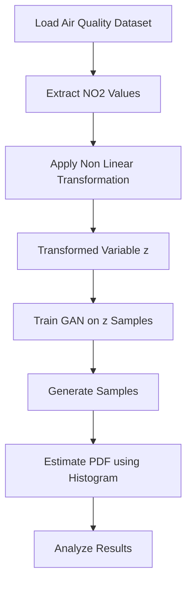
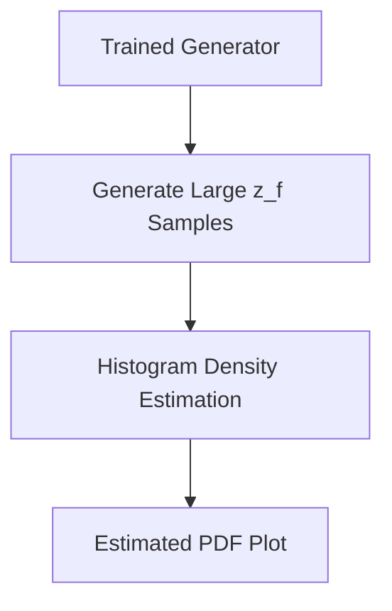

# Probability-density-function-using-GAN
Learning probability density functions using GAN (data only)

---

## 📌 Project Overview

This project focuses on learning the probability density function (PDF) of a transformed random variable using only data samples, without assuming any analytical or parametric form of the distribution.

A Generative Adversarial Network (GAN) is used to implicitly model the unknown probability distribution of the transformed variable. The generator learns to produce samples that resemble the real data distribution, and the learned PDF is approximated using histogram-based density estimation.

All steps — data preprocessing, transformation, GAN training, and PDF approximation — are implemented in a single Jupyter Notebook to ensure clarity, reproducibility, and ease of experimentation.

---

## 🎯 Project Objectives

- Learn an unknown probability density function from data samples only
- Apply a non-linear transformation to real-world data
- Design a simple GAN suitable for 1-D distribution learning
- Generate samples from the trained generator
- Approximate and visualize the learned PDF
- Analyze training behavior and quality of generated distribution

---

## 📂 Repository Structure

Learning-PDF-using-GAN/
│
├── gan_pdf_learning.ipynb
└── README.md

---

## 🔄 Overall Workflow

⚖️ Dataset Description
The dataset contains air quality measurements collected across India

The NO₂ (Nitrogen Dioxide) concentration is used as the input feature

Only raw NO₂ values are used

The dataset represents a continuous real-world random variable

🔁 Step 1: Data Transformation
Each NO₂ value x is transformed using the function:

z = x + a_r sin(b_r x)
Where:

a_r = 0.5 × (r mod 7)

b_r = 0.3 × ((r mod 5) + 1)

r is the university roll number

This transformation produces a new variable z with an unknown, non-parametric distribution.

🤖 Step 2: PDF Estimation using GAN
A Generative Adversarial Network (GAN) is used to learn the distribution of the transformed variable z.

GAN Architecture
Generator

Input: 1-D noise sampled from N(0,1)

Fully connected layers with ReLU activation

Output: Single scalar value (fake z)

Discriminator

Input: Scalar value (real or fake z)

Fully connected layers

Output: Probability using Sigmoid activation

GAN Training Flow

Key Properties
GAN learns only from samples of z

No parametric PDF is assumed

PDF is learned implicitly through generated samples

📊 Step 3: PDF Approximation
After training:

A large number of samples are generated from the generator

Histogram density estimation is used to approximate the PDF

📉 Results and Observations

Mode Coverage

The generator captures the main regions of the transformed data distribution.

Training Stability

Generator and discriminator losses stabilize after sufficient epochs.

Quality of Generated Distribution

Generated samples closely resemble the real transformed data in shape and spread.

✅ Conclusion

GANs can learn unknown probability density functions using data only

Simple fully connected GANs are sufficient for 1-D data

Histogram estimation provides a clear PDF approximation

The approach is fully data-driven and non-parametric

🚀 How to Use This Repository

Clone the repository

Open gan_pdf_learning.ipynb

Run all cells sequentially

Modify parameters if required

Observe changes in the learned PDF

📌 Author Note

This project emphasizes conceptual clarity, non-parametric learning, and reproducibility.
It demonstrates the use of GANs beyond image generation to learn probability distributions directly from data.
